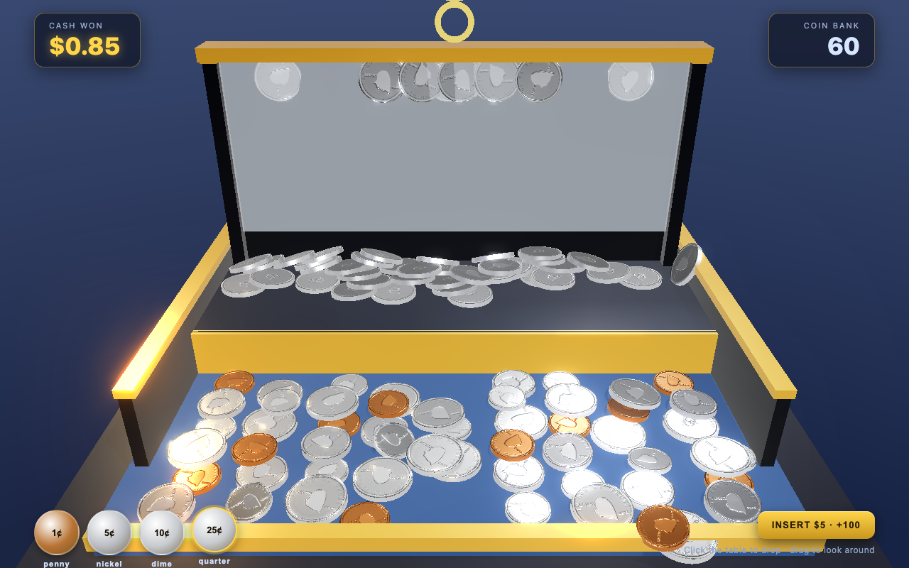

# Coin Pusher Deluxe

A highly realistic 3D coin-pusher arcade game that runs in the browser. Real-time
physics, PBR metal coins minted to look like US currency, dynamic shadows,
environment reflections, and bloom.



## Stack

- **[Three.js](https://threejs.org/)** — WebGL rendering (PBR materials, shadows,
  `RoomEnvironment` reflections, `UnrealBloomPass`).
- **[Rapier](https://rapier.rs/)** (`@dimforge/rapier3d-compat`) — 3D rigid-body
  physics. Hundreds of coins stack and tumble with real collisions.
- **Vite + TypeScript**.

No image, model, or audio assets are bundled — coin faces are procedurally
"minted" on a canvas (relief heightmap → normal / roughness / albedo maps) and
all sound is synthesized with the Web Audio API.

## Run it

```bash
npm install
npm run dev      # opens http://localhost:5173
```

Production build:

```bash
npm run build    # type-checks then bundles to dist/
npm run preview
```

## How to play

- **Click the table** to drop the selected coin into the **glass chute**. Each
  drop costs one coin from your **Coin Bank**. Coins fall face-on through a thin
  gap between the back board and the glass (just one coin thick), stack up behind
  the glass, then tumble out the bottom onto the moving pusher.
- **Drag** to orbit the camera; **scroll** to zoom in and inspect the minted
  relief on the coins.
- Pick a denomination (penny / nickel / dime / quarter) from the bottom-left,
  or press **1–4**. **Space** also drops a coin.
- Coins shoved over the front lip land in the tray and add their value to
  **Cash Won**. Coins that slip off the front sides are lost.
- Bank a flurry of coins quickly to trigger a **JACKPOT**.
- **Insert $5** refills your bank with 100 coins.

## Where things live

| Area | File |
| --- | --- |
| Shared geometry + coin definitions + glass chute | `src/config.ts` |
| Procedural coin textures (relief → normal/roughness/albedo) | `src/coins/coinTexture.ts` |
| Coin geometry + PBR materials + instanced meshes | `src/coins/coinFactory.ts` |
| Spawn / pooling / physics-to-render sync / payout detection | `src/coins/coinManager.ts` |
| Rapier world (fixed-timestep) | `src/physics/world.ts` |
| Static cabinet colliders + kinematic pusher | `src/physics/machine.ts` |
| Renderer, lights, env, bloom, camera | `src/render/scene.ts` |
| Visual cabinet mesh | `src/render/cabinet.ts` |
| Economy / scoring / jackpot logic | `src/game/state.ts` |
| Synthesized SFX | `src/audio/sfx.ts` |
| HUD overlay | `src/ui/hud.ts`, `src/ui/style.css` |
| Bootstrap + input + main loop | `src/main.ts` |

## Tuning

Most of the feel lives in `src/config.ts`: coin sizes/values, deck dimensions,
pusher stroke/speed, the drop point, scoring thresholds, the coin cap
(`MAX_COINS`), starting bank, and jackpot trigger. Lighting and bloom live in
`src/render/scene.ts`; physics friction/restitution/density in
`src/physics/machine.ts` and `src/coins/coinManager.ts`.

> The production bundle is large because Rapier's WebAssembly is inlined as
> base64 by the `-compat` build. That keeps setup zero-config; switch to the
> non-compat `@dimforge/rapier3d` package with a wasm loader if you need a
> smaller bundle.
